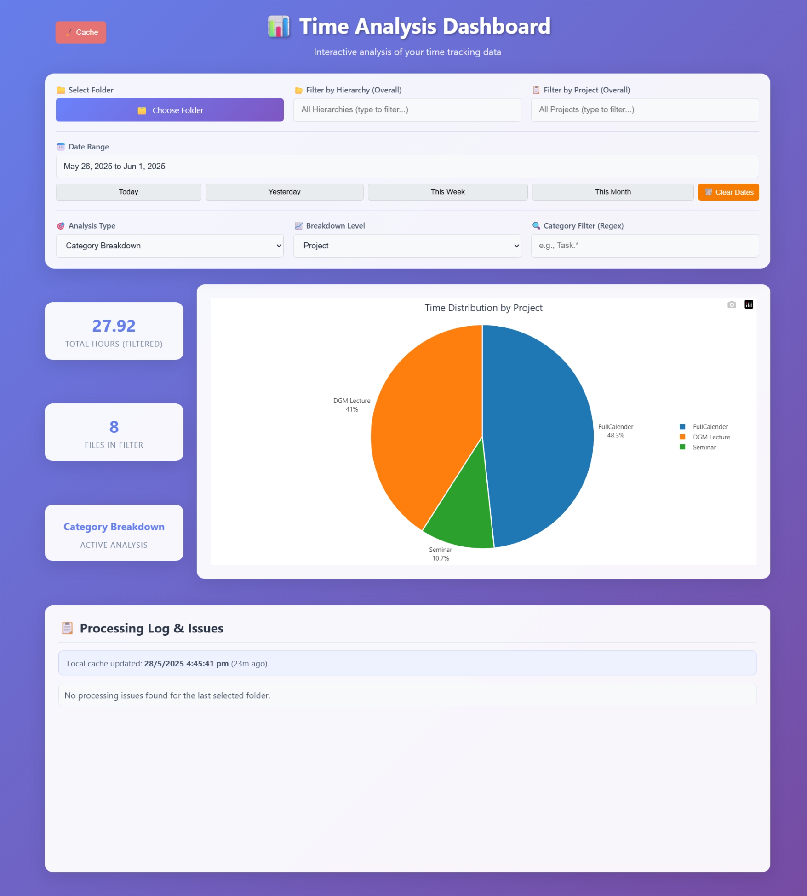
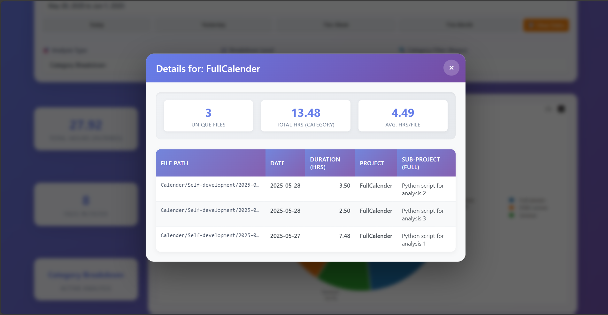

# Time Analysis - v2.5

[](https://github.com/YouFoundJK/Time-Analyser-Full-Calender/blob/main/LICENSE)
[](https://youfoundjk.github.io/Time-Analyser-Full-Calender/)


### Usecase
Think of Personal Finance Accounting but now in time.
Parses through .md files in the directory with three levels of hierarchy for filtering. Following is the formatting for hierarcy classification

```
CalenderParent/
├── Work/                          <-- Hierarchy Level 1: Subfolder "Work"
│   ├── [date] [Hierarchy Level 2:Project] - [Hierarchy Level 3:SubProject] <int>.md        (one time event)
│   ├── ([Every M]) [Hierarchy Level 2:Project] - [Hierarchy Level 3:SubProject] <int>.md   (recurring event)
│   ├── 2023-10-26 Client A - Design Phase 1.md
│   ├── 2023-11-06 Client A - Design Phase 2.md
│   ├── 2023-10-27 Client A - Development Sprint 2.md
│   └── (Every M) Team Meetings - Weekly Sync.md  (recurring event)
│   
│
├── Personal/                      <-- Hierarchy Level 1: Subfolder "Personal"
│   ├── Fitness/                   <-- This folder level is NOT currently used
│   │   ├── [date] [Hierarchy Level 2:Project] - [Hierarchy Level 3:SubProject] <int>.md
│   │   └── 2023-11-01 Gym - Workout Routine A.md
```

### Features
- **Interactive Charts**: Instantly visualize how your time is distributed across Hierarchies, Projects, or Sub-projects. Click segments for a detailed breakdown.
- Flexible Analysis & Filtering: Drill down into your data by Hierarchy, Project, or Sub-project. Apply custom text/regex filters to pinpoint specific activities and see cumulative time for any category.
- **Local Storage Caching**: Enjoy significantly faster load times. Once processed, your file data is cached locally (browser level), speeding up subsequent analyses.
Detailed Statistics: Get an immediate overview of total hours, files processed, active categories, and equivalent days at a glance.
- **Smart Data Parsing**: Automatically extracts task details (project, sub-project, duration) from your Markdown filenames and YAML front matter, including support for recurring tasks - compactible with Full Calender plugin for obsidian YAML formatting.
- **Date based filtering**: Filter events based on start and end day criteria.

### Useage
Download the [latest release](https://github.com/YouFoundJK/Time-Analyser-Full-Calender/releases/latest) and open the `.html` file in your favourite browser.

### Gallery


